# Event-Driven Architecture
## Process 1000s Orders/Second with Azure

Complete Tutorial - Part 1/8

  
    Press Space for next page <carbon:arrow-right class="inline"/>
  

  <a href="https://github.com/your-repo" target="_blank" alt="GitHub" title="Open in GitHub"
    class="text-xl slidev-icon-btn opacity-50 !border-none !hover:text-white">
    <carbon-logo-github />
  </a>

---
layout: center
class: text-center
---

# The Black Friday Problem

  💥 10,000 Orders in 10 Minutes

  
Server Crashes

  
Orders Lost

  
Customers Angry

  
Revenue Gone 📉

---
layout: center
class: text-center
transition: fade
---

# What If This Could Happen Instead?

  ✅ Handle Traffic Spikes

  ✅ Zero Lost Orders

  ✅ Happy Customers

  That's Event-Driven Architecture

---
layout: two-cols
---

# Traditional Synchronous

### The Problem
Customer submits order → System validates → Checks inventory → Processes payment → Sends email → Updates analytics → **THEN responds**

### Response Time

8 seconds

❌ 1-second delay = **7% conversion loss**

❌ 8 seconds = **50% customers lost**

❌ Any step fails = **Everything fails**

::right::

# Event-Driven Approach

### The Solution
Customer submits → **Immediate response** → Everything else happens in background

### Response Time

80ms

✅ **80X faster** response

✅ Sub-100ms - higher conversions

✅ Zero lost orders

✅ Auto-scaling - handle any spike

---
layout: center
class: text-center
---

# The Key Insight

  

    Separate Accepting from Processing
  

  

    
1️⃣ Accept

    
Store in queue → Return instantly

    
⚡ 50ms

  

  

    
2️⃣ Process

    
Background processor → Handle work → Retry if fails

    
🔄 2-5s

  

---
layout: center
---

# Architecture Overview

  5 Components • Simple • Production-Ready

---
layout: default
---

# Component 1: Next.js Frontend

  

    

      <h3 class="text-xl text-blue-400 mb-2">🏪 Your Storefront</h3>
      
Where users submit orders

    

    

      <h3 class="text-xl text-green-400 mb-2">🛠 Tech Stack</h3>
      <ul class="text-base list-disc list-inside">
        <li>Next.js</li>
        <li>TypeScript</li>
        <li>TailwindCSS</li>
      </ul>
    

    

      <h3 class="text-xl text-purple-400 mb-2">☁ Hosting</h3>
      
Azure Static Web Apps

      
Globally distributed

    

  

  

    
🌐

  

---
layout: default
---

# Component 2: HTTP Function

  

    

      <h3 class="text-2xl text-blue-400 mb-3">📝 The Receptionist</h3>
      

        Like a receptionist at a busy restaurant
      

    

    

      <h3 class="text-xl text-green-400 mb-2">What It Does:</h3>
      <ol class="text-base list-decimal list-inside space-y-1">
        <li>Validates the order</li>
        <li>Generates an ID</li>
        <li>Publishes to queue</li>
        <li>Returns 201 Created</li>
      </ol>
    

  

  

    
⚡

    

      
Response Time

      
50-80ms

    

  

---
layout: default
---

# Component 3: Service Bus Queue

  

    🔒 Guaranteed Delivery Service
  

  

    NEVER loses messages
  

  

    
💾 Persistence

    
Persist until processed

  

  

    
🔄 Built-in Retry

    
Up to 10 attempts

  

  

    
☠ Dead Letter Queue

    
Failed message handling

  

  

    
📋 FIFO Ordering

    
Sequential processing

  

  ✅ Guaranteed processing

---
layout: default
---

# Component 4: Queue Processor

  

    

      <h3 class="text-2xl text-purple-400 mb-3">🏢 The Back Office</h3>
      

        Does the actual work • Automatically triggers when messages arrive
      

    

    

      <h3 class="text-xl text-blue-400 mb-2">Handles:</h3>
      <ul class="text-base space-y-1">
        <li>✅ Inventory checks</li>
        <li>✅ Payment processing</li>
        <li>✅ Confirmations</li>
        <li>✅ Status updates</li>
      </ul>
    

  

  

    
⚙️

    

      
If it fails?

      
Message → Queue (auto retry)

      
After 10 fails → Dead letter

    

  

---
layout: default
---

# Component 5: Application Insights

  

    

      <h3 class="text-xl text-cyan-400 mb-2">🔭 The Observatory</h3>
      

        Every operation is tracked
      

    

    

      <h3 class="text-lg text-blue-400 mb-1">Monitors:</h3>
      <ul class="text-sm space-y-0.5">
        <li>📊 Orders per second</li>
        <li>⏱ Processing times</li>
        <li>🚨 Error rates</li>
        <li>📈 Queue depth</li>
        <li>🔍 End-to-end tracing</li>
      </ul>
      

        Covered in Part 5
      

    

  

  

    
📊

  

---
layout: center
---

# Complete Flow with Timing

```mermaid {theme: 'dark', scale: 0.5}
sequenceDiagram
    participant User
    participant HTTP as HTTP Function
    participant Queue as Service Bus
    participant Processor as Queue Processor
    participant Insights as App Insights

    User->>HTTP: Submit Order (0ms)
    HTTP->>HTTP: Validate & Publish (50ms)
    HTTP-->>User: 201 Success (80ms) ✅
    Note over User: User is happy!
    HTTP->>Queue: Store Message
    Queue->>Processor: Trigger Processing
    Processor->>Processor: Process Order (2-5s)
    HTTP->>Insights: Log Request
    Processor->>Insights: Log Processing
```

  

    User waits 80ms
  

  

    Processing happens in background
  

  

    ✨ That's the magic ✨
  

---
layout: two-cols
---

# Service Bus vs Event Grid

## The One Question Decision

  "Can I afford to lose this message?"

Event Grid - Fire and Forget

**Use for:**
- ⚡ Button clicks / analytics
- 📁 File notifications
- 🌡 IoT readings (1000s/sec)
- 📡 Telemetry

**Think:** "Hey, something happened"

::right::

Service Bus - Guaranteed

**Use for:**
- 🛒 **Orders** ✅ Cannot lose $10K order
- 💳 **Payments** - Must complete
- 🏦 **Financial** - Compliance
- 📦 **Inventory** - Must be accurate

**Think:** "MUST be processed"

  

    For our order system:
  

  

    We need guaranteed delivery, retry logic, dead letter queues, FIFO ordering
  

  

    → Service Bus
  

---
layout: center
class: text-center
---

# Tech Stack & Universal Pattern

Azure Functions

TypeScript

Next.js

Bicep

  
This pattern works everywhere

  
Payment processing • Email campaigns • Data pipelines • Inventory • Notifications • Reports

  

    
1️⃣

    
Accept fast

  

  

    
2️⃣

    
Queue reliably

  

  

    
3️⃣

    
Process async

  

  

    
4️⃣

    
Monitor all

  

  Build production systems in hours instead of weeks 🚀

---
layout: center
---

# Series Roadmap

  
✅

  
Part 1

  
Architecture

  
2️⃣

  
Part 2

  
Deploy infrastructure with Bicep

  
3️⃣

  
Part 3

  
Build HTTP Function

  
4️⃣

  
Part 4

  
Queue Processor with retry logic

  
5️⃣

  
Part 5

  
Monitoring and dashboards

  
6️⃣

  
Part 6

  
Next.js frontend setup

  
7️⃣

  
Part 7

  
Complete UI integration

  
8️⃣

  
Part 8

  
CI/CD automation

  Each video builds on the last • By Part 8, you'll have a production-ready system

---
layout: default
---

# Prerequisites Setup

  
Set This Up Before Part 2

  
Total setup time: ~15 minutes • Everything is free tier

  
☠Azure Account

  <a href="https://azure.com/free" class="text-blue-300 underline text-sm">azure.com/free</a>
  
Free tier includes everything we need

  
⚡ Node.js 20

  <a href="https://nodejs.org" class="text-green-300 underline text-sm">nodejs.org</a>
  
Required for Next.js and Functions

  
🛠 Azure CLI

  <a href="https://learn.microsoft.com/cli/azure/install-azure-cli" class="text-purple-300 underline text-sm">Install Guide</a>
  
Deploy infrastructure from terminal

  
⚙ Azure Functions Core Tools

  <a href="https://learn.microsoft.com/azure/azure-functions/functions-run-local" class="text-orange-300 underline text-sm">Install Guide</a>
  
Local development and testing

  
💡 Recommended: VS Code with Azure Extensions

---
layout: center
class: text-center
---

# Coming Next

  
Part 2

  
Deploy Infrastructure with Bicep

  
One command • Full Azure environment

  🔔 Subscribe to get notified when it's live

  See you there! Happy building! 🚀

